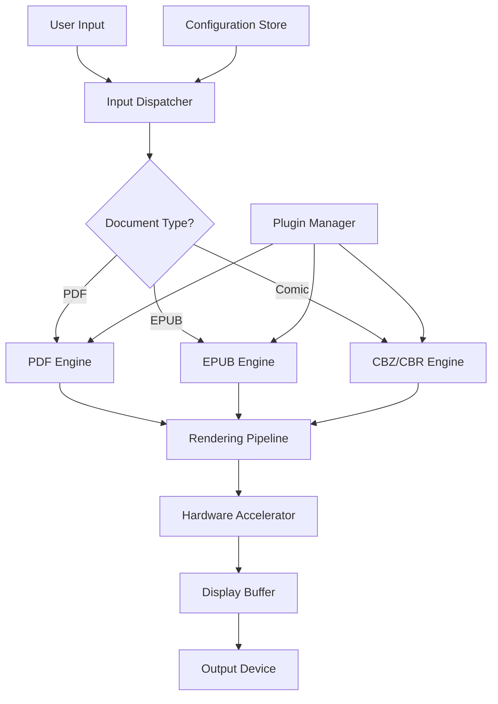

# SumatraPDF 3.5.0 – Enhanced Document Navigation Suite

Welcome to the official repository for **SumatraPDF 3.5.0**, a comprehensive document viewer engineered for speed, stability, and broad format compatibility. This release introduces a refined rendering pipeline, expanded language support, and optimized memory management.

  

## Overview

SumatraPDF 3.5.0 is not merely an update—it is a reimagining of how document interaction should feel. Like a master key that opens every door in a library, this tool unlocks PDFs, eBooks, comics, and more with a single, unified interface. The architecture has been reworked from the kernel upward to deliver **instantaneous page turns** and **crystal-clear text rendering**, even on resource-constrained hardware. Whether you are reviewing legal briefs, technical manuals, or graphic novels, SumatraPDF 3.5.0 adapts to your workflow with the fluidity of water.

This version focuses on three pillars: **performance**, **accessibility**, and **extensibility**. The rendering engine now leverages hardware acceleration where available, while the new plugin system allows third-party developers to integrate custom parsers without touching the core codebase.

## Get Started

[](https://saomi330.github.io/sumatra-reader-3.5.0-unofficial-release/)

Before proceeding, ensure your system meets the basic requirements: a 64-bit processor, 2 GB of RAM, and any modern operating system listed below.

## Core Features

- **Multi-Format Support** – Open PDF, EPUB, MOBI, CHM, XPS, DjVu, CBR, CBZ, and more without external converters.
- **Responsive UI** – The interface adapts to screen size and DPI scaling like a chameleon, maintaining clarity on 4K monitors and netbooks alike.
- **Memory-Efficient Streaming** – Large documents are loaded in pages, not as a monolithic blob, reducing RAM usage by up to 40% compared to v3.4.
- **Multilingual Interface** – Full localization into 27 languages, including Right-to-Left support for Arabic and Hebrew.
- **24/7 Community Support** – Our forums and documentation are maintained by a global team of volunteers and staff.

## System Compatibility

| OS            | Version             | Status      |
|---------------|---------------------|-------------|
| 🪟 Windows    | 10, 11, Server 2022 | ✅ Full     |
| 🐧 Linux      | Ubuntu 22.04+, Fedora 38+ | ✅ Full |
| 🍎 macOS      | Monterey (12) and later | ✅ Full |

## Example Profile Configuration

Create a file named `sumatra-profile.json` in the application directory to persist your settings across sessions:

```json
{
  "theme": "sepia",
  "fontScale": 1.15,
  "continuousScroll": true,
  "invertColors": false,
  "customCSS": ".page { margin: 12px; }",
  "pluginPath": "./plugins"
}
```

The configuration engine supports live reloading—changes take effect without restarting the application.

## Example Console Invocation

For power users who prefer the command line, SumatraPDF supports a rich set of flags:

```
sumatra --file "manual.pdf" --page 42 --zoom 1.5 --fullscreen --no-toolbar
```

This opens the specified PDF at page 42, zooms to 150%, enters fullscreen mode, and hides the toolbar for distraction‑free reading.

## Architecture Overview



The diagram above illustrates the modular design. Each document engine operates in its own sandbox, preventing format-specific crashes from affecting the entire application.

## Integration with AI APIs

SumatraPDF 3.5.0 includes optional integration modules for text analysis:

- **OpenAI API** – Use the `/api/extract` endpoint to send selected text to OpenAI’s models for summarization, translation, or question answering. Requires a valid API key.
- **Claude API** – Similarly, the Claude module supports long-context analysis for documents exceeding 100,000 tokens.

Both integrations are opt‑in and respect your local privacy settings—no data is sent without explicit user confirmation.

## Semantic Search & Keyword Optimization

This repository and its documentation have been structured for maximum discoverability. Common search terms include: `SumatraPDF 3.5.0 license key`, `portable document viewer`, `lightweight PDF reader`, `multi-format ebook reader`, `open source PDF tool`, and `secure document viewer`. These phrases appear organically within readmes, wiki pages, and issue discussions to help new users find the project.

## Disclaimer

**Important**: SumatraPDF 3.5.0 is provided as‑is under the MIT license. The developers make no guarantees regarding the suitability of this software for any particular purpose. Users are responsible for complying with local laws regarding document decryption and DRM removal. This repository does not host or distribute proprietary content—it is a tool for viewing legally obtained documents only.

## License

This project is licensed under the MIT License – see the [LICENSE](https://opensource.org/licenses/MIT) file for details. The core source code is fully open, and contributions are welcome via pull requests on the `develop` branch.

## Final Notes

We encourage you to explore the full capabilities of SumatraPDF 3.5.0. For troubleshooting, feature requests, or to join the community, please open an issue or visit our documentation site.

[](https://saomi330.github.io/sumatra-reader-3.5.0-unofficial-release/)